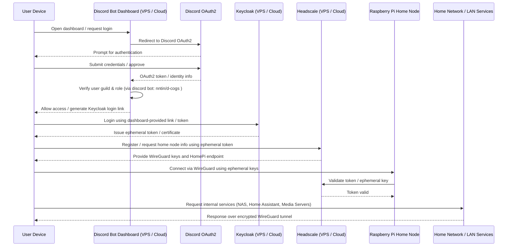

# D-VPN

**D-VPN** is a cloud-first, zero-trust VPN solution that allows secure access to a hidden home network. It leverages:

- **Discord Bot Dashboard (Cloud/VPS)** for authentication and role verification  
- **Keycloak (Cloud/VPS)** as the mandatory OIDC broker issuing ephemeral tokens  
- **Headscale (Cloud/VPS)** for node discovery and ephemeral WireGuard key distribution  
- **WireGuard** for encrypted VPN tunnels  
- **Raspberry Pi** as the hidden home VPN node hosting LAN services  

This repository contains setup instructions and configurations for the Discord bot, Keycloak, Headscale server, and Raspberry Pi VPN node.

---

## Table of Contents

- [Architecture](#architecture)  
- [Features](#features)  
- [Prerequisites](#prerequisites)  
- [Setup Instructions](#setup-instructions)  
  - [Discord Bot & Dashboard](#discord-bot--dashboard)  
  - [Keycloak Server](#keycloak-server)  
  - [Headscale Coordination Server](#headscale-coordination-server)  
  - [Home Raspberry Pi Node](#home-raspberry-pi-node)  
- [Sequence Diagram](#sequence-diagram)  

---

## Architecture

```
User Device -> Discord Bot Dashboard (Cloud/VPS) -> Discord OAuth2 -> Keycloak (Cloud/VPS) -> Headscale (Cloud/VPS) -> Raspberry Pi Home Node -> LAN Services
```

1. Users authenticate first via **Discord Bot Dashboard** (guild + role verification).  
2. Dashboard allows verified users to login to **Keycloak**, which issues **ephemeral credentials**.  
3. User registers with **Headscale**, receiving WireGuard keys and Raspberry Pi endpoint info.  
4. User connects to the **hidden WireGuard server** on Raspberry Pi, and accesses LAN services over encrypted tunnel.  

---

## Features

- **Discord-first authentication**: only authorized guild members with the required role can proceed  
- **Keycloak-backed**: issues ephemeral credentials for VPN access, enabling future extensibility with other auth methods  
- **Headscale-managed WireGuard**: node discovery and ephemeral key distribution  
- **Hidden home network**: Raspberry Pi is never exposed publicly  
- **Zero-trust security**: ephemeral credentials ensure only authorized devices can connect  
- **Multi-device support**: laptops, desktops, and mobile devices  

---

## Prerequisites

- Cloud VPS for **Discord Bot Dashboard**, **Keycloak**, and **Headscale**  
- Discord bot (e.g., [d-cogs](https://github.com/nntin/d-cogs))  
- Raspberry Pi with WireGuard installed at home  
- Basic knowledge of Docker or Linux services  

---

## Setup Instructions

### Discord Bot & Dashboard

1. Deploy the Discord Bot Dashboard to a cloud server.  
2. Configure the bot:
   - OAuth2 client for login  
   - Verify user guild membership and roles  
   - Generate a Keycloak login link after verification  
3. Only users passing Discord verification can proceed to Keycloak authentication.  

### Keycloak Server

1. Deploy Keycloak on a cloud VPS.  
2. Configure it to accept login requests from the Discord Bot dashboard.  
3. Keycloak issues **ephemeral tokens or certificates** for users authorized by the Discord Bot.  

### Headscale Coordination Server

1. Deploy Headscale on a cloud VPS.  
2. Configure authentication to require ephemeral tokens issued by Keycloak.  
3. Register the Raspberry Pi node with Headscale.  
4. Headscale distributes ephemeral WireGuard keys and home node info to authenticated devices.  

### Home Raspberry Pi Node

1. Install WireGuard on the Raspberry Pi.  
2. Configure it to register with Headscale.  
3. Validate ephemeral tokens for all incoming connections.  
4. Connect LAN services (NAS, Home Assistant, Media Servers) behind the node.  

---

## Sequence Diagram



### Key Notes

1. **Discord-first authentication**  
   This is the core goal of the project. Only users who are verified members of a specific Discord guild with the required roles can gain access to the VPN. This ensures that access is tightly controlled and managed entirely via Discord, which acts as the primary identity source.

2. **Keycloak**  
   Currently, Keycloak acts as an additional layer between Headscale and Discord authentication. After a Discord user is verified via the Discord Dashboard, Keycloak issues ephemeral tokens or certificates that are required to register with Headscale and access the WireGuard server. In the future, this layer allows us to integrate additional authentication methods, enabling flexibility beyond Discord-only access.

3. **Headscale**  
   Headscale is responsible for coordinating node discovery and distributing ephemeral WireGuard keys. It ensures that users only learn about the VPN server after successful authentication and handles the ephemeral key lifecycle for zero-trust security.

4. **VPN Node (Raspberry Pi or alternative)**  
   At the end of the workflow, the user connects to a VPN node (currently a Raspberry Pi) that validates the ephemeral token or certificate issued by Keycloak. This node provides access to LAN services such as NAS, Home Assistant, or media servers. In the future, this node could be replaced or extended with alternative hardware or cloud-hosted endpoints.

5. **Repository Scope**  
   This repository ([d-vpn](https://github.com/nntin/d-vpn)) implements the **Discord Dashboard**, **Keycloak**, and **Headscale** components. The Discord Bot responsible for guild and role verification is implemented separately ([d-cogs](https://github.com/nntin/d-cogs)) and interacts with the dashboard to control access.

6. **Zero-trust philosophy**  
   By combining ephemeral credentials, cloud-first authentication, and hidden VPN node discovery, the architecture ensures that no device can access the home network without passing through strict authentication and authorization checks. The WireGuard server remains hidden until all verification steps succeed.
