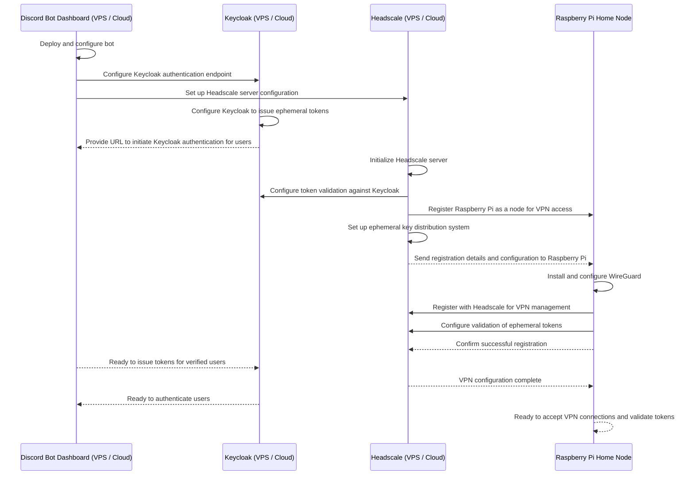

# Sequence Diagram: Setting up the system



# Headscale UI Setup

Follow these steps to let the Headscale UI talk to your Headscale instance without 401 errors.

1) Make sure the stack is running: `docker compose up -d`
2) Create an API key from the Headscale container (the debug line about `HEADSCALE_CLI_ADDRESS` is normal):
   `docker exec headscale headscale apikeys create --expiration 720h`
Copy the returned token (example: `InSTKih.gJpg4OPPYMOuI6NloJN-K3ILC8o6wgke`).
3) Open the UI at `http://localhost:8081`
4) In the UI settings, set:
   - Headscale URL: `http://localhost:8080` (from your host). If configuring from another container on the same Docker network, use `http://headscale:8080`.
   - API key: paste the token from step 2.
5) Reload the page and retry; the UI stores `headscaleURL` and `headscaleAPIKey` in your browser’s localStorage. If you still see 401s, verify the URL is reachable and the key is valid/unexpired.

# Headscale CLI Bootstrap (no UI)

1) Ensure the stack is running: `docker compose up -d`
2) Create the initial admin user in Headscale (message about `HEADSCALE_CLI_ADDRESS` is normal):
   `docker exec headscale headscale users create admin`
3) Confirm the user exists and note the ID (should be `1`):
   `docker exec headscale headscale users list`
4) Generate a reusable preauth key for the admin user (ID 1) with a 30-day expiry:
   `docker exec headscale headscale preauthkeys create --user 1 --reusable --expiration 720h`
   The generated key (current run): `9d320d6e6fa361f08586ec81d931d3b430f6bb7899a74739`
5) Use that preauth key to connect a client (example with Tailscale client on the host):
   `tailscale up --login-server http://localhost:8080 --authkey 9d320d6e6fa361f08586ec81d931d3b430f6bb7899a74739`
   From another container on the same Docker network, point `--login-server` to `http://headscale:8080` instead of localhost.

# WireGuard Home Node & Peer Distribution (no Tailscale client)

Goal: run `docker compose up` with minimal manual steps. Headscale will distribute WireGuard keys + HomePi endpoint to authenticated users (per the sequence diagram).

Current lightweight/manual flow (until automation is added):
1) Start the stack: `docker compose up -d`
2) Generate server keys once:
   `docker exec wireguard-server sh -c 'umask 077; mkdir -p /config/server; wg genkey > /config/server/privatekey-server; wg pubkey < /config/server/privatekey-server > /config/server/publickey-server'`
3) Use the existing template `wg-config/templates/server.conf` to populate `wg-config/wg_confs/wg0.conf` with your desired subnet and server IP (e.g., 10.13.13.0/24, server at 10.13.13.1). Keep PostUp/PostDown NAT rules as-is.
4) Restart WireGuard: `docker compose restart wireguard`
5) For a test peer, generate keys and add a single `[Peer]` entry (temporary approach):
   - `docker exec wireguard-server sh -c 'PEER=peer1; umask 077; mkdir -p /config/$PEER; wg genkey > /config/$PEER/privatekey-$PEER; wg pubkey < /config/$PEER/privatekey-$PEER > /config/$PEER/publickey-$PEER; wg genpsk > /config/$PEER/presharedkey-$PEER'`
   - Append to `wg-config/wg_confs/wg0.conf`:
     ```
     [Peer]
     PublicKey = $(cat /config/peer1/publickey-peer1)
     PresharedKey = $(cat /config/peer1/presharedkey-peer1)
     AllowedIPs = 10.13.13.2/32
     ```
   - Create `peer1.conf` for the user with the generated keys and `Endpoint = <HOME_ENDPOINT>:51820`.
   - Restart WireGuard again: `docker compose restart wireguard`

This manual peer flow will be replaced by automation (Headscale/dashboard) so users receive a ready-to-use WireGuard config without shell steps.
