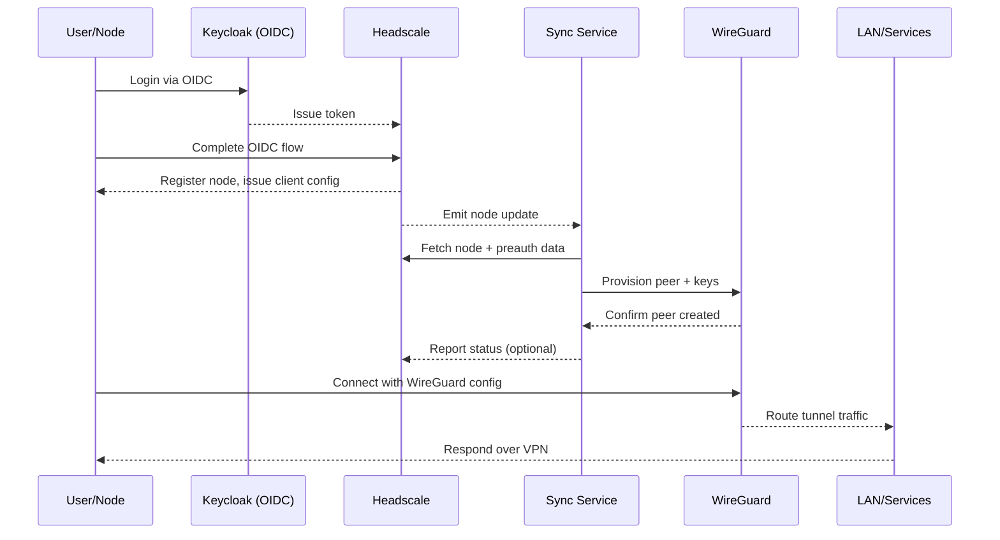

# d-vpn Hybrid Proof-of-Work Setup

Local development guide for the hybrid architecture (Headscale for discovery, WireGuard for tunnels, sync service as the bridge). The stack auto-bootstraps on first start—no manual realm imports or WireGuard templating required.

> **CI Status:** All tests run automatically on push/PR. Check the [GitHub Actions](https://github.com/nntin/d-vpn/actions) page for current build status.

## Architecture Diagram



## Prerequisites

- Docker and Docker Compose
- git
- curl (for quick API tests)

> Note: This guide targets local development / PoW of Option C (hybrid Headscale + WireGuard with sync service).

## Quick Start

```bash
# 1) Clone
git clone https://github.com/your-org/d-vpn.git
cd d-vpn

# 2) Env + Headscale API key
cp .env.example .env
docker compose exec headscale headscale apikeys create --expiration 720h
# add the returned key to HEADSCALE_API_KEY in .env

# 3) Boot everything
docker compose up -d
# all services self-configure on first start (Keycloak realm, OIDC client, WireGuard keys, sync wiring)
```

## Service Verification

- **Keycloak**: `docker compose logs keycloak | grep "Imported realm d-vpn"`; visit `http://localhost:8180` (admin/admin) and confirm the `d-vpn` realm exists (see `keycloak/realm-export/README.md`).
- **Headscale**: `docker compose exec headscale headscale health`; look for OIDC init logs; UI at `http://localhost:8081`.
- **WireGuard**: `docker exec wireguard-server wg show`; ensure no `No valid tunnel config found` in logs and that `wg0` exists.
- **Sync Service**: `docker compose logs sync-service` for successful Headscale connection; health at `curl http://localhost:5000/health`; confirm state file is created.

## OIDC Authentication Flow

```bash
# create a Headscale user for testing
docker exec headscale headscale users create testuser

# optional: generate a preauth key instead of OIDC
docker exec headscale headscale preauthkeys create --user testuser --reusable --expiration 720h
```

- OIDC path: open `http://localhost:8080`, click login, and follow the redirect to Keycloak.
- Use the test user credentials from `keycloak/realm-export/README.md`: `testuser` / `testpass`.
- After login, the node is registered in Headscale. Confirm via `docker exec headscale headscale nodes list` or in the UI at `http://localhost:8081`.

## Retrieving WireGuard Peer Config

- The sync service auto-creates a WireGuard peer when a node registers.
- Watch creation logs: `docker compose logs sync-service`.
- List peers: `curl http://localhost:5000/peers`.
- Fetch config for a specific node (use the Headscale node ID):  
  `curl http://localhost:5000/peer/<node_id>/config`
- Save the output to a file and import into your WireGuard client. The config includes the server public key, endpoint `localhost:51820`, peer private key, and allowed IPs.

## Testing VPN Connection

1. Install a WireGuard client on your host or test device.
2. Import the peer config from the sync service.
3. Connect and verify the tunnel.
4. Test reachability: `ping 10.13.13.1` (WireGuard server).
5. Check server logs for handshakes: `docker compose logs wireguard-server`.

## Troubleshooting

- **Services not starting**: `docker compose logs <service>`; ensure required ports are free.
- **Keycloak realm not imported**: `docker compose down -v && docker compose up -d` to rebuild volumes.
- **Headscale OIDC errors**: Confirm Keycloak is healthy; verify issuer URL and client secret in `headscale/config/config.yaml`.
- **WireGuard interface missing**: Inspect init script logs; ensure keys exist in `/config/server/`; check `wg0.conf` was generated.
- **Sync service cannot reach Headscale**: Confirm `HEADSCALE_API_KEY` in `.env`; regenerate if needed; ensure Headscale API responds.
- **Sync service cannot reload WireGuard**: Verify Docker socket mount and WireGuard container name; validate `wg0.conf` syntax.
- **Peer config absent**: Ensure the node exists in Headscale and the sync poll interval elapsed; review sync logs and state file.
- **VPN connection fails**: Validate peer config, check UDP 51820 availability, and confirm handshake logs on the server.

## Service URLs & Credentials

| Service | URL / Endpoint | Credentials |
| --- | --- | --- |
| Headscale API | `http://localhost:8080` | n/a |
| Headscale UI | `http://localhost:8081` | API key from `.env` |
| Keycloak Admin | `http://localhost:8180` | admin / admin |
| Keycloak Test User | Keycloak login | testuser / testpass |
| Sync Service API | `http://localhost:5000` | n/a |
| WireGuard UDP | `localhost:51820` | use peer config |

## Testing

- Running Tests Locally: `pwsh ./tests/Run-AllTests.ps1` to execute the complete suite (individual + integration tests).
- Individual Tests: `pwsh ./tests/Run-IndividualTests.ps1` to run service tests without integration coverage.
- CI Automation: All tests run automatically in CI on every commit.
- Test Documentation: See `tests/README.md` for detailed test information and troubleshooting.

## Next Steps

- Run tests to verify setup: `pwsh ./tests/Run-AllTests.ps1`
- See `TODO.md` Milestone 2.5 for end-to-end verification checklist.
- Milestone 3 (Discord Dashboard) is deferred.
- Advanced sync service settings: `sync-service/README.md`.
- Keycloak realm details: `keycloak/realm-export/README.md`.

## Architecture Notes

- Headscale drives node lifecycle and discovery via OIDC.
- WireGuard carries the actual VPN traffic.
- Sync service watches Headscale and provisions WireGuard peers accordingly.
- This is a custom hybrid path (not stock Headscale/Tailscale). See the "Architecture Notes" section in `TODO.md` for deeper context.
