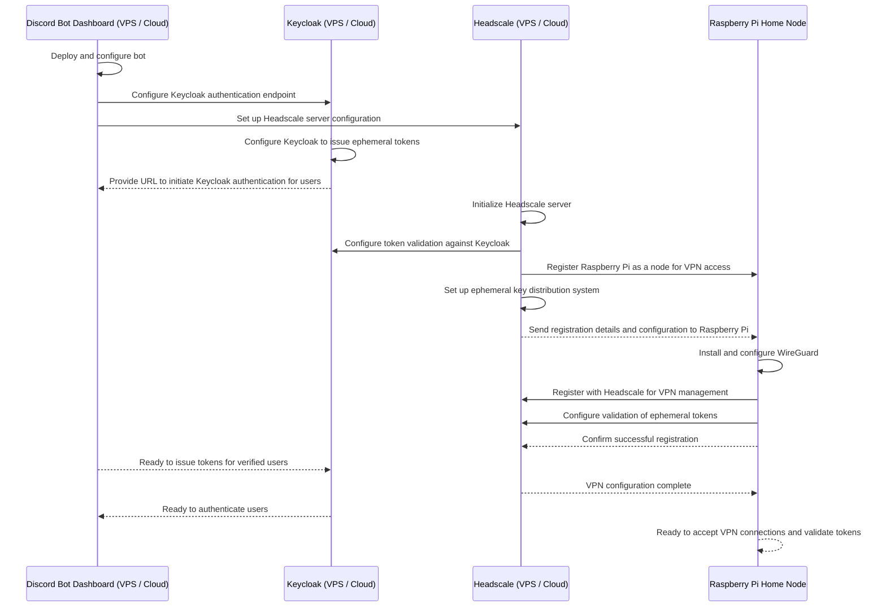

# D-VPN Local Development Plan

## Sequence Diagram

This document outlines the steps to set up a local development environment for D-VPN using Docker Compose. The initial focus is on getting the core components (Headscale, Keycloak, WireGuard) working together before building the Discord dashboard.

## Milestone 1: Local Environment Setup with Docker Compose

- [x] **Create `docker-compose.yml`:**
    - [x] Define a service for **Headscale**.
    - [x] Define a service for **Keycloak**.
    - [x] Define a service for a **WireGuard Server** (acting as the home node for local dev).
    - [x] Add a service for a web UI for Headscale (e.g., `headscale-ui`) for easier development.
    - [x] Configure a shared Docker network for inter-service communication.
    - [x] **Note:** Ensure the WireGuard server is configured to allow connections from the Headscale network, and can route traffic to other services if needed.
- [x] **Initial Configuration Files:**
    - [x] Create a basic `headscale/config.yaml` to be mounted into the container.
    - [x] Create directories for persistent data for Keycloak and Headscale.
    - [x] Create necessary configuration for the WireGuard server (e.g., `wg0.conf`).
- [x] **Launch Environment:**
    - [x] Run `docker-compose up -d` and ensure all containers start correctly.
    - [x] Document the default URLs and admin credentials for Keycloak and Headscale.

## Milestone 2: Core Services Auto-Bootstrap (Keycloak + Headscale + WireGuard)

- [ ] **Configure Headscale Admin:**
    - [x] Access the Headscale container.
    - [x] Create an initial admin user/namespace.
    - [ ] Automate Headscale UI bootstrap: generate an API token in Headscale and inject it (URL + token) into the Headscale UI/localStorage without manual steps.
- [ ] **Configure WireGuard Home Node & Client Flow (no Tailscale client):**
    - [x] Generate a pre-auth key in Headscale for the admin user (for future device bootstrap).
    - [ ] Prepare the WireGuard node (the `wireguard` service) to serve as the endpoint distributed by Headscale.
    - [ ] Automate WireGuard server key generation and `wg0.conf` creation on `docker compose up` (no manual edits); fix “No valid tunnel config found” and drop `SYS_MODULE` if not needed on WSL2.
    - [ ] Automate peer creation and config distribution: Headscale (or a helper) issues WireGuard peer configs with HomePi endpoint, no shell steps.
    - [ ] Verify a test peer can connect to the home node using the distributed WireGuard config.
- [ ] **Configure Keycloak Admin (user-facing auth only; Discord bot deferred):**
    - [ ] Automate Keycloak bootstrap for local dev: create realm (e.g., `d-vpn`), client for Headscale, and a test user.
    - [ ] Wire Headscale to Keycloak OIDC automatically (update `headscale/config.yaml`, restart) so user devices only interact with Keycloak to fetch WireGuard details.
    - [ ] Validate the user-device flow: obtain token from Keycloak, Headscale returns WireGuard keys + HomePi endpoint, no manual steps.

## Milestone 3: Discord Dashboard (Deferred)

*Once the local backend is fully integrated and tested, work can begin on the frontend.*

- [ ] **Develop Discord Bot Dashboard:** Create a simple web application for the user-facing dashboard.
- [ ] **Implement Discord OAuth2:** Add a "Login with Discord" feature.
- [ ] **Implement Guild/Role Verification:** After login, the dashboard must verify the user's Discord server membership and roles.
- [ ] **Integrate Dashboard with Keycloak:** After successful verification, redirect the user to Keycloak to complete the authentication and device registration flow with Headscale.
