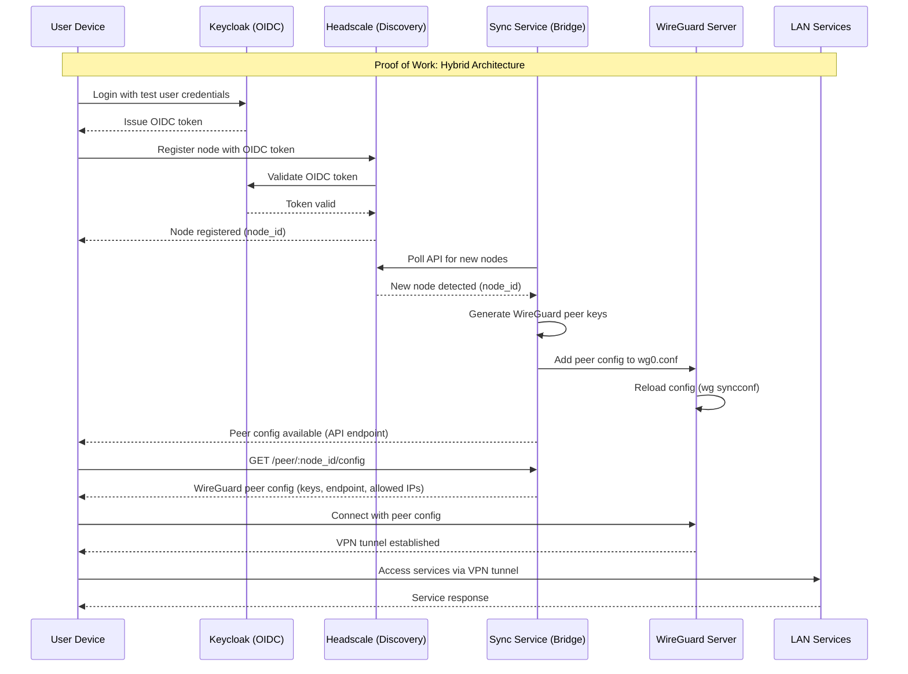

# D-VPN Local Development Plan

## Sequence Diagram

Hybrid Proof of Work: Headscale handles node discovery via Keycloak OIDC, WireGuard provides the VPN tunnel, and a custom sync service bridges discovery to tunnel provisioning. This PoW aims for moderate automation (auto-configured services with manual peer testing).

## Milestone 1: Local Environment Setup with Docker Compose

- [x] **Create `docker-compose.yml`:**
    - [x] Define a service for **Headscale**.
    - [x] Define a service for **Keycloak**.
    - [x] Define a service for a **WireGuard Server** (acting as the home node for local dev).
    - [x] Add a service for a web UI for Headscale (e.g., `headscale-ui`) for easier development.
    - [x] Configure a shared Docker network for inter-service communication.
    - [x] **Note:** Ensure the WireGuard server is configured to allow connections from the Headscale network, and can route traffic to other services if needed.
- [x] **Initial Configuration Files:**
    - [x] Create a basic `headscale/config.yaml` to be mounted into the container.
    - [x] Create directories for persistent data for Keycloak and Headscale.
    - [x] Create necessary configuration for the WireGuard server (e.g., `wg0.conf`).
- [x] **Launch Environment:**
    - [x] Run `docker-compose up -d` and ensure all containers start correctly.
    - [x] Document the default URLs and admin credentials for Keycloak and Headscale.

✅ Milestone 1 Complete - All services running in Docker Compose

## Milestone 2: Hybrid Core Services Auto-Bootstrap (Headscale + Sync Service + WireGuard)

**Milestone 2.1: WireGuard Server Auto-Configuration**
- [x] Create initialization script for WireGuard container
- [x] Auto-generate server private/public keys if not present in `/config/server/`
- [x] Auto-populate `wg-config/wg_confs/wg0.conf` from `wg-config/templates/server.conf` template
- [x] Use subnet `10.13.13.0/24` with server IP `10.13.13.1`
- [x] Add entrypoint script to `docker-compose.yml` WireGuard service
- [x] Ensure idempotent (don't regenerate if keys exist)
- [x] **Verification:** Run `docker compose up`, check WireGuard logs show no "No valid tunnel config found" error, verify `wg show` displays interface

**Milestone 2.2: Keycloak Realm, Client, and Test User Bootstrap**
- [x] Create Keycloak bootstrap script/container that runs on startup
- [x] Auto-create realm `d-vpn` if not exists
- [x] Create OIDC client `headscale` with redirect URIs `http://localhost:8080/oidc/callback`
- [x] Create test user `testuser` with password `testpass`
- [x] Export client secret for Headscale configuration
- [x] Use Keycloak Admin REST API or import JSON realm config
- [x] Add init container or startup script to `docker-compose.yml`
- [x] **Verification:** Access Keycloak admin console, verify realm `d-vpn` exists, client `headscale` configured, test user can login

✅ **Milestone 2.2 Complete** - Keycloak realm auto-import configured. Client secret: `d-vpn-headscale-secret-change-in-production` (documented in `keycloak/realm-export/README.md`)

**Milestone 2.3: Headscale OIDC Integration with Keycloak**
- [x] Update `headscale/config/config.yaml` with OIDC configuration
- [x] Set issuer URL to `http://keycloak:8080/realms/d-vpn`
- [x] Configure client ID `headscale` and client secret from Keycloak bootstrap
- [x] Add OIDC callback URL configuration
- [x] Create init script to inject OIDC config dynamically if needed (static configuration chosen for PoW simplicity; no init script created)
- [x] Restart Headscale to apply OIDC config
- [x] **Verification:** Check Headscale logs show OIDC provider initialized (`docker compose logs headscale | grep -i oidc`), run `docker compose exec headscale headscale health`, access Headscale UI OIDC login flow at `http://localhost:8080` (or via Caddy `http://localhost:8081`)

✅ **Milestone 2.3 Complete** - Headscale OIDC configured with Keycloak realm `d-vpn`. Static config used for PoW (inline client_secret). Restart Headscale with `docker compose restart headscale` to apply.

**Milestone 2.4: Custom Sync Service - Headscale Nodes to WireGuard Peers**
- [x] Create custom sync service (Python/Go) in new directory `sync-service/`
- [x] Implement Headscale API polling/webhook listener for new node registrations
- [x] Auto-generate WireGuard peer private/public keys for each Headscale node
- [x] Add peer configuration to WireGuard `wg0.conf` dynamically
- [x] Reload WireGuard config without restart using `wg syncconf wg0 <(wg-quick strip wg0)`
- [x] Expose REST API endpoint (e.g., `GET /peer/:node_id/config`) to retrieve peer WireGuard config
- [x] Add sync service to `docker-compose.yml` with dependencies on `headscale` and `wireguard`
- [x] Implement health checks and error handling
- [x] **Verification:** Register test node in Headscale, verify sync service logs show peer creation, check `wg show` on WireGuard server displays new peer, retrieve peer config via API endpoint

✅ **Milestone 2.4 Complete** - Sync service implemented in Python with Flask API. Service polls Headscale API every 30s, generates WireGuard peer keys, allocates IPs sequentially from 10.13.13.2, appends peers to wg0.conf, and reloads with `wg syncconf`. REST API exposes peer configs at `GET /peer/:node_id/config`. State persisted in JSON file. Added to docker-compose.yml with shared volumes and docker socket access.

**Setup Instructions**:
1. Generate Headscale API key: `docker exec headscale headscale apikeys create -e 999d`
2. Copy `.env.example` to `.env` and set `HEADSCALE_API_KEY`
3. Run `docker compose up -d --build` to start sync service
4. Verify logs: `docker compose logs sync-service`
5. Check health: `curl http://localhost:5000/health`

**Milestone 2.5: End-to-End Verification (Proof of Work)**
- [ ] Run `docker compose down -v && docker compose up -d` (clean start)
- [ ] Verify all containers start without errors (check logs for each service)
- [ ] Verify Keycloak realm `d-vpn` auto-created with client and test user
- [ ] Verify Headscale OIDC config points to Keycloak
- [ ] Verify WireGuard server config auto-generated with keys
- [ ] Register test node in Headscale via OIDC flow (manual step for PoW)
- [ ] Verify sync service auto-creates WireGuard peer for test node
- [ ] Retrieve peer config from sync service API
- [ ] Test WireGuard connection from peer to server
- [ ] **Success Criteria:** All services running, no error logs, OIDC flow works, peer can connect to WireGuard server

## Architecture Notes

- Headscale is used for discovery and node lifecycle, backed by Keycloak OIDC for identity.
- WireGuard provides the VPN tunnel, keeping control of tunnel parameters and standard WG tooling.
- The sync service bridges discovery to tunnel provisioning by watching Headscale and configuring WireGuard peers.
- This is a custom hybrid approach (not standard Headscale) pairing OIDC-based discovery with direct WireGuard tunnels for PoW.

## Milestone 3: Discord Dashboard (Deferred)

*Once the local backend is fully integrated and tested, work can begin on the frontend.*

- [ ] **Develop Discord Bot Dashboard:** Create a simple web application for the user-facing dashboard.
- [ ] **Implement Discord OAuth2:** Add a "Login with Discord" feature.
- [ ] **Implement Guild/Role Verification:** After login, the dashboard must verify the user's Discord server membership and roles.
- [ ] **Integrate Dashboard with Keycloak:** After successful verification, redirect the user to Keycloak to complete the authentication and device registration flow with Headscale.
